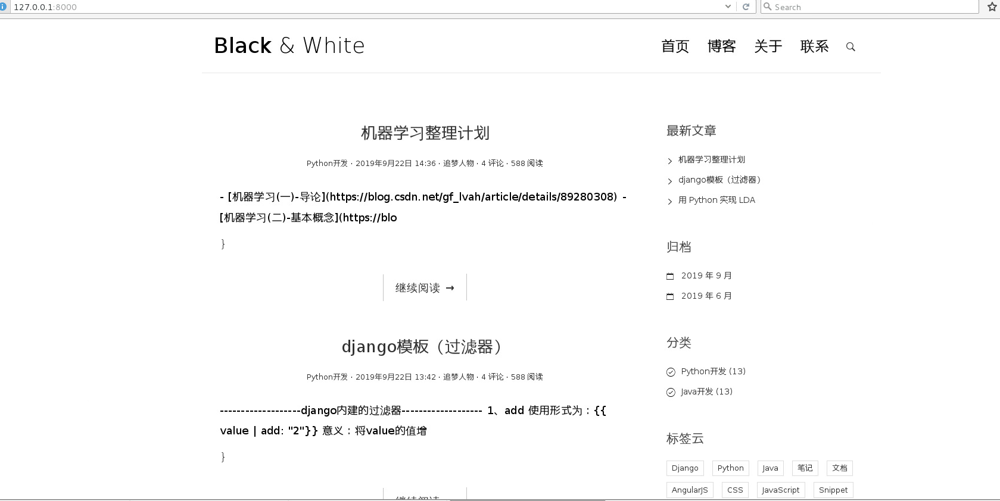
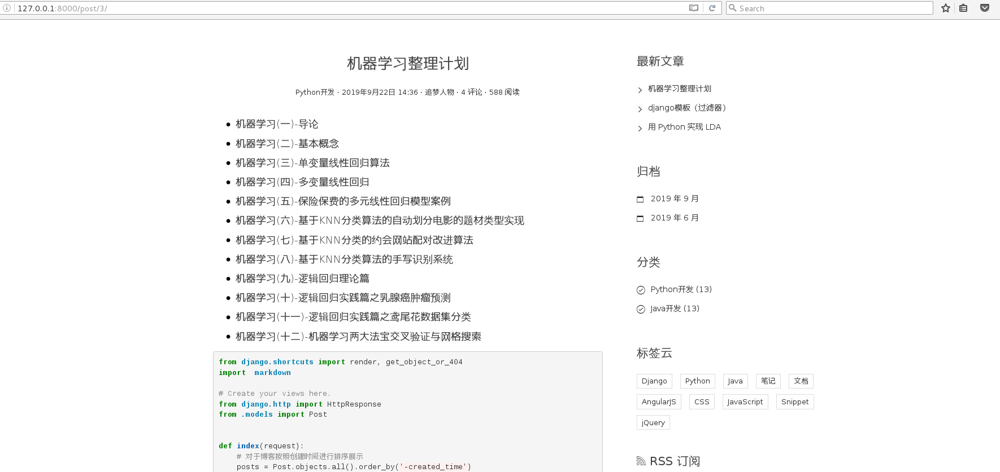

# 项目介绍
随着互联网的飞速发展,让Internet应用在全球范围内日趋普及,当今社会也正快速向信息化社会发展,开
发个人博客有着非常重要的意义。本系统采用 Django 技术,后台开发工具为 Pycharm ,前台开发工具为
Pycharm ,数据库采用 MySQL 来进行开发。该文主要包含游客前台阅读、留言博文, 功能,后台用户登录
注册、管理个人博客, 精确地记录一篇文章的阅读量, 自动生成文章摘要等功能。为了让博客文章具有良
好的排版,显示更加丰富的格式,支持 Markdown 语法和代码高亮。 这种博客是一种可以快速发布并
且及时更新信息的网站,用户可以简洁快速地完成博客的书写、公布和更新,很好实现用户体验,大大提高
了用户的工作效率。
# 系统环境
- python3.7
- Django2.2

# 项目效果展示

